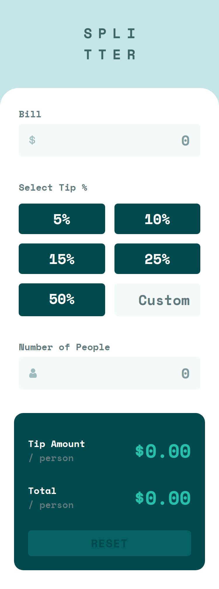
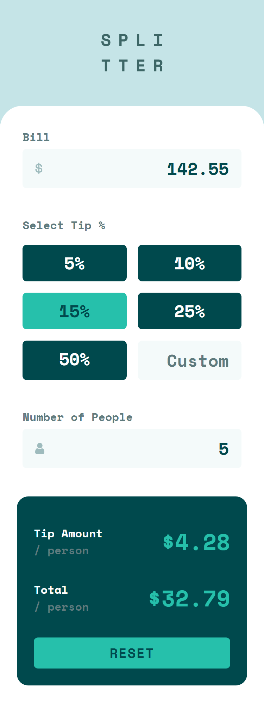
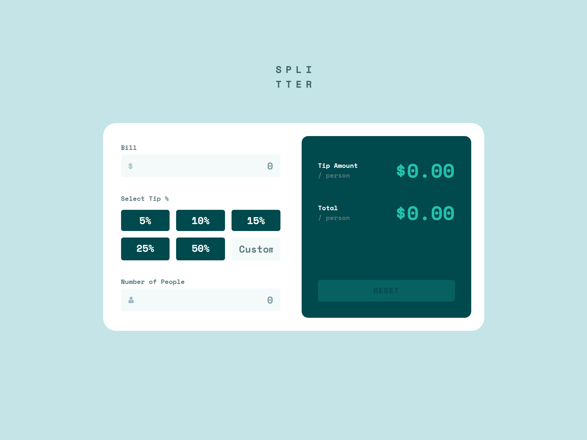
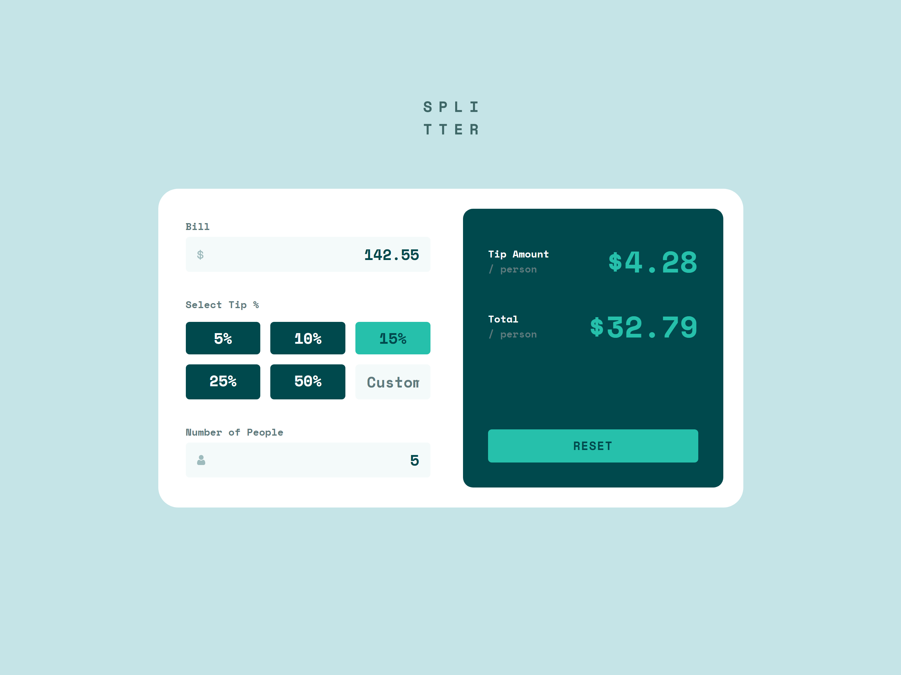
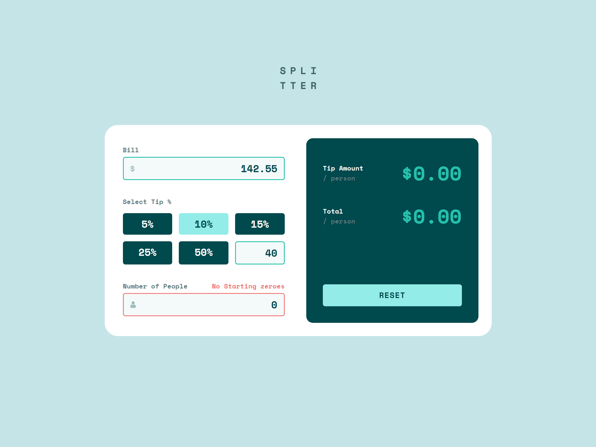

# Frontend Mentor - Tip calculator app solution

This is a solution to the [Tip calculator app challenge on Frontend Mentor](https://www.frontendmentor.io/challenges/tip-calculator-app-ugJNGbJUX). Frontend Mentor challenges help you improve your coding skills by building realistic projects.

## Table of contents

- [Overview](#overview)
  - [The challenge](#the-challenge)
  - [Screenshot](#screenshot)
  - [Links](#links)
- [My process](#my-process)
  - [Built with](#built-with)
  - [What I learned](#what-i-learned)
  - [Continued development](#continued-development)
- [Author](#author)

## Overview

This is the sixth and final Challenge for the **JavaScript Fundamentals Frontend Mentor Roadmap**.

It consists of a **Tip Calculator**. that divides a certain bill by a number of people accounting for the tipping.

### The challenge

Users should be able to:

- View the optimal layout for the app depending on their device's screen size
- See hover states for all interactive elements on the page
- Calculate the correct tip and total cost of the bill per person

### Screenshot

#### Mobile

##### Initial View

##### Final View

##### Interactive View

#### Desktop

##### Initial View

##### Final View

##### Interactive View

### Links

- Solution URL: [Add solution URL here](https://your-solution-url.com)
- Live Site URL: [Add live site URL here](https://your-live-site-url.com)

## My process

### Built with

- Semantic HTML5 markup
- CSS custom properties
- Flexbox
- CSS Grid
- Mobile-first workflow
- Vanilla JS

### What I learned

I used a form element and inputs of type text for the *Bill*, *Custom Tip* and *number of people*. the tip percentages are radio buttons.

I used the `pattern` html attribute to validate the text inputs along with `required`. At first I wanted to use inputs of type number but it seems I can't get rid of some default appearances of input of type number in  a standard way. so I sticked with inputs of type text. and added a `keydown` events on those inputs to disallow letters so they act more like inputs of type number.

On the javascript side we just listen for *change* events on each text input and on each radio button. when that happens we validate if the contents of the input are valid if they are we start the calculation which only executes if all necessary information was inputted by the user and is valid.

### Continued development

This Roadmap was very fun. using only Vanilla JS enhances your understanding of plain JavaScript. and I'm sure it'll contribute to the next roadmap.

The next roadmap we'll tackle will be **Intro to JavaScript Frameworks**. 

## Author

- Frontend Mentor - [@ilyesab](https://www.frontendmentor.io/profile/ilyesab)

